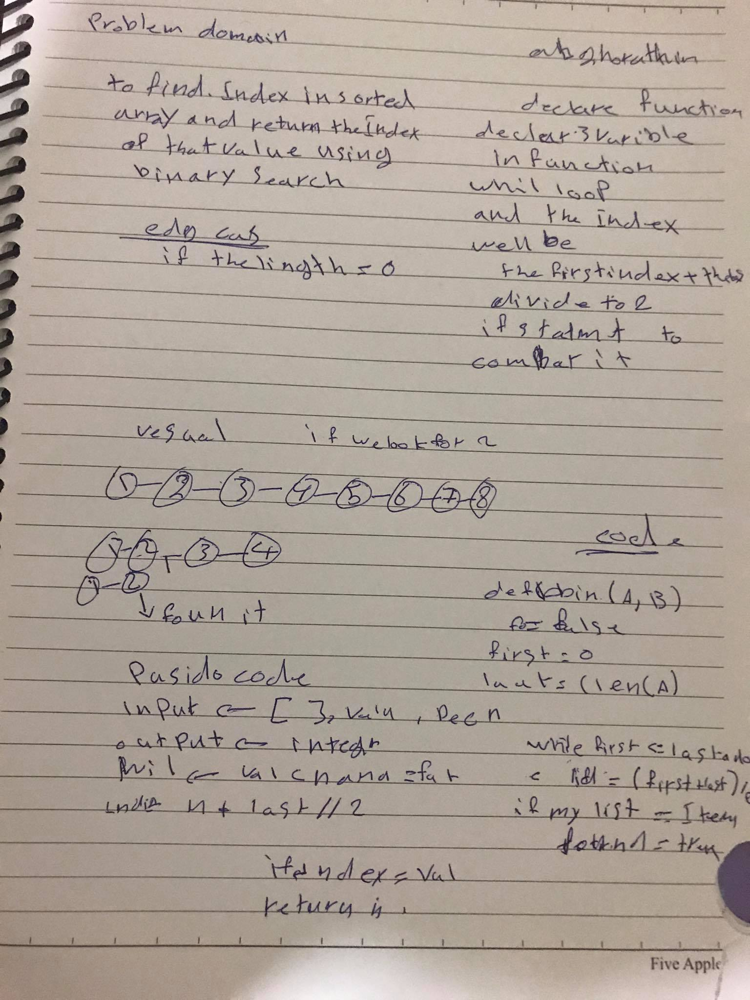

# array binary search
use  while loop and  if to check if the value in the array and compare it weth the value of array'indexes and return the index

## Challenge
function that take array and value 
then check if the value in the array 
and return the index

## Approach & Efficiency
loops (for) 
if statment 

## Solution

