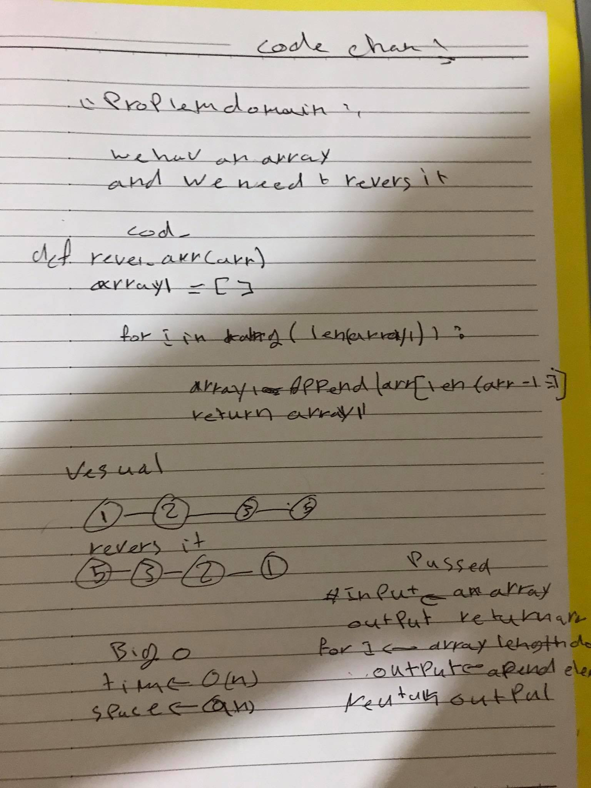

# Reverse an Array
use loop to itrate for array and copy the last index like the first one in the new array
## Challenge
function that take an array and revers it

## Approach & Efficiency
loops (for)

## Solution

