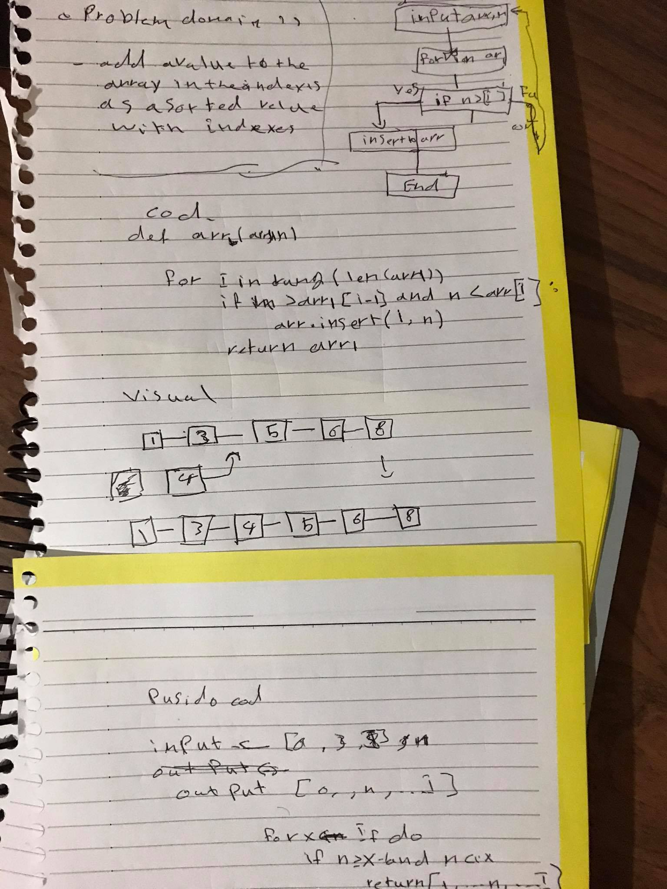

# array sheft 
use loop to itrate for array and compare bet indexes 
value in its place
## Challenge
function that take an array and add number in sorted array 

## Approach & Efficiency
loops (for)

## Solution

