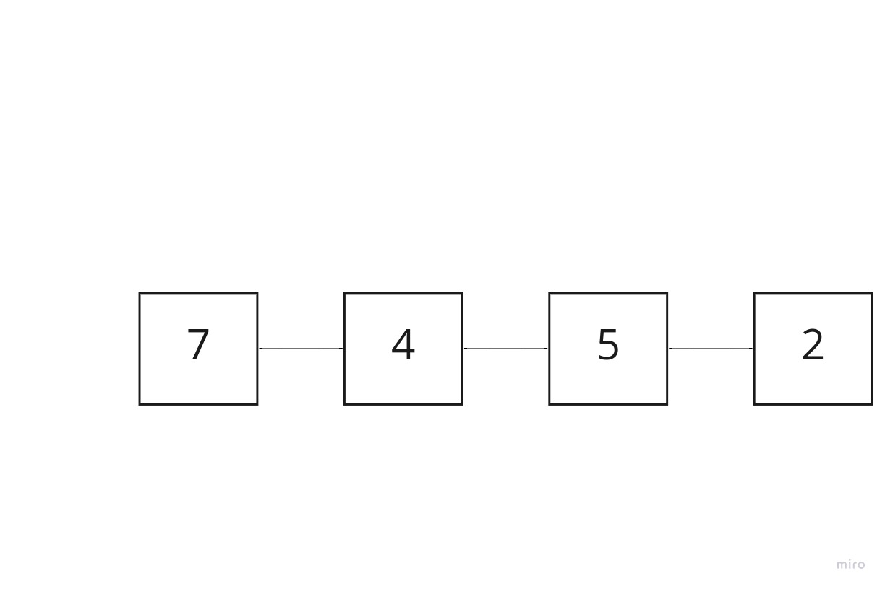
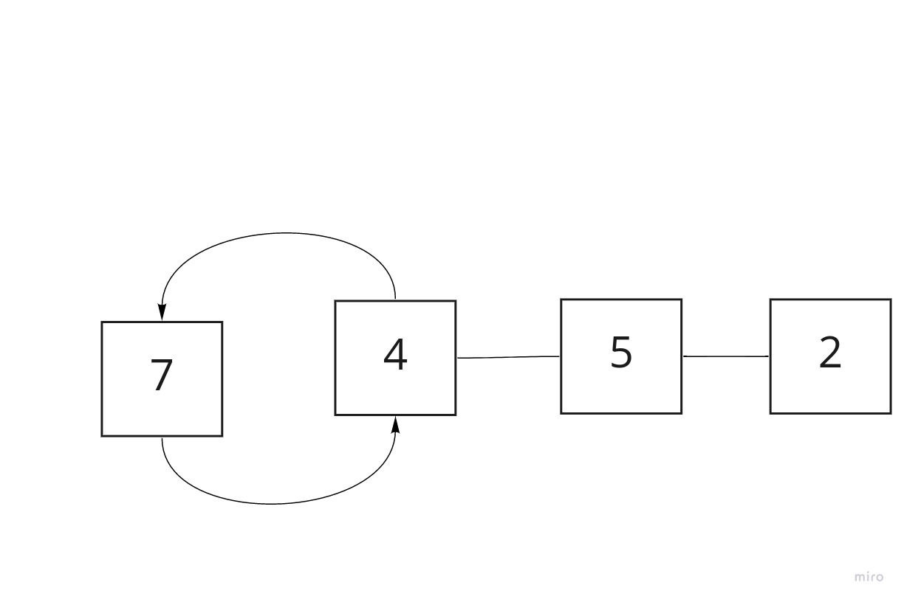
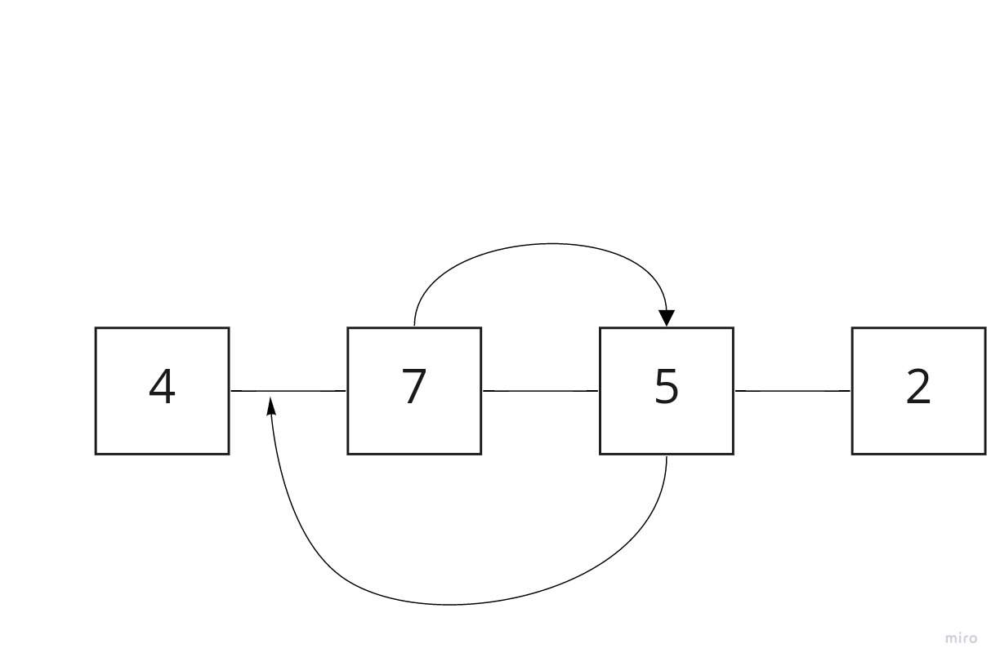
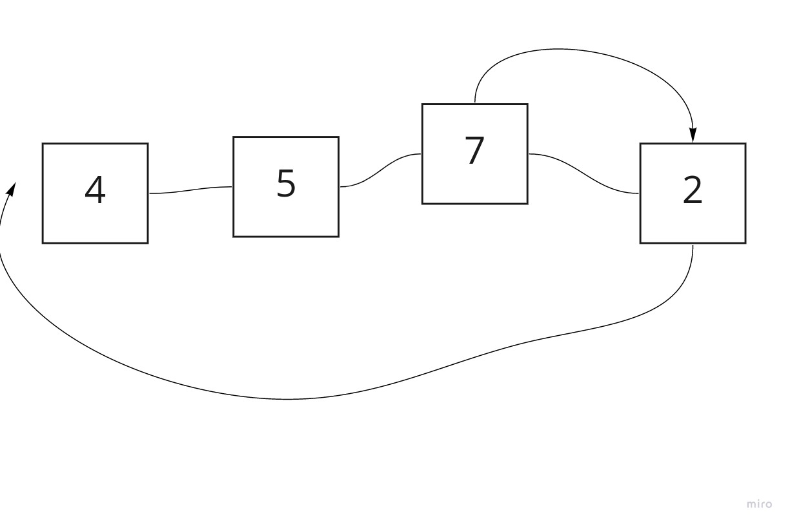
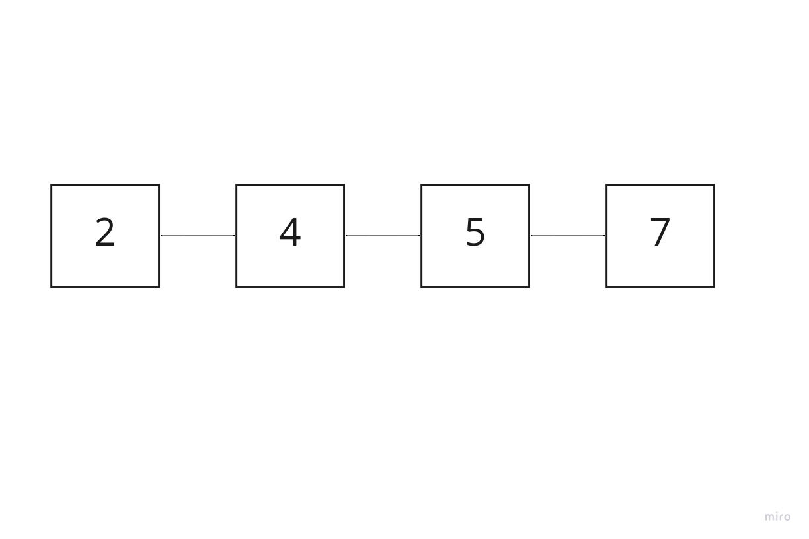

# insertion sort

### pseudo code

`    FOR i = 1 to arr.length

      int j <-- i - 1
      int temp <-- arr[i]

      WHILE j >= 0 AND temp < arr[j]
        arr[j + 1] <-- arr[j]
        j <-- j - 1

      arr[j + 1] <-- temp
`
## description

insertion sort looks though the 
list/array and temporarily 
removes the second index, 
storing it in a value. this 
leaves a gap for the list to be 
modified and moved. each loop 
through the array will remove 
and store each index value at 
its cooresponding loop, (loop 1 
= index 1, loop 2 = index 2, 
loop 3 = index 3 ...) this 
leaves a value to the left and right of the stored value.

remove index 1 and compare that 
value to index 0 if the left is 
greater than the value then 
shift it to the right and place 
the value in the new gap on the 
left (the the left value of the 
gap is still less, continue 
moving the value to the right)

 1- - remove index 1 and compare that value to index 0 because 7 is greater than 4, we move 7 to the right and fill the gap, then put for into the new gap where 7 used to be (idx 0)

2 - remove index 2 and compare that value to index 1 because 4 is less 
than not greater than 7, 7 goes back into its spot. no shifting has 
occured in this loop

3 - remove index 3 and compare that value to index 2 because 7 is  than/  greater than 5, we move 7 to the right and fill the gap, then put for into the new gap

4- As all the element on left side of 2 are grater than 2, so all the elements will be moved forword and 2 will be shifted to position of 4 

