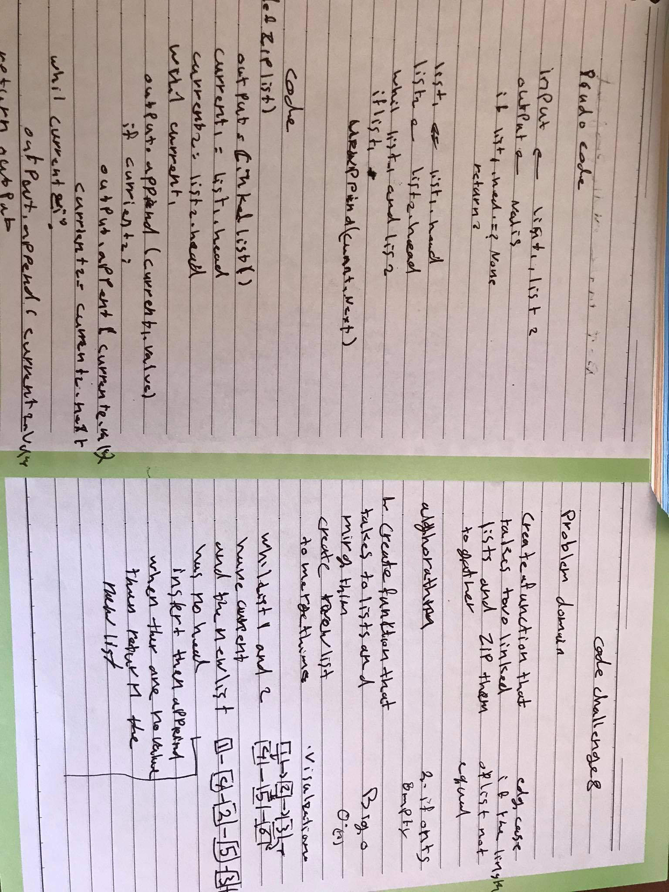

# zip-2linked list
make function to merge 2 linked list on the order for each one

## Challenge
function that take take 2 list and return one after zip them 

## Approach & Efficiency
loops (while) 
if statment 

Big O of n

## Solution

