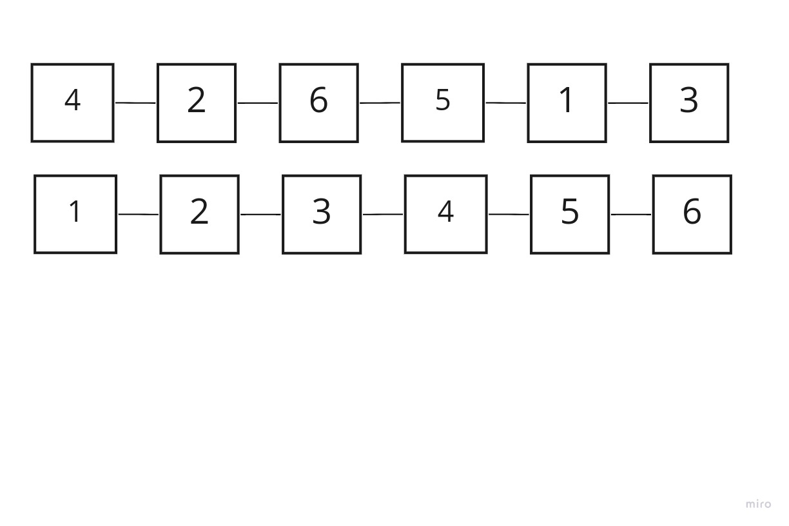
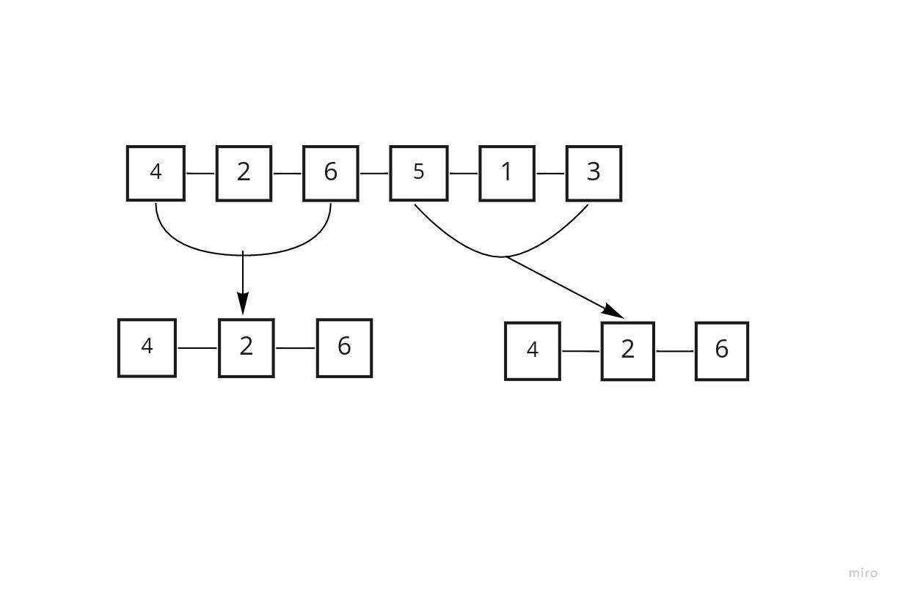
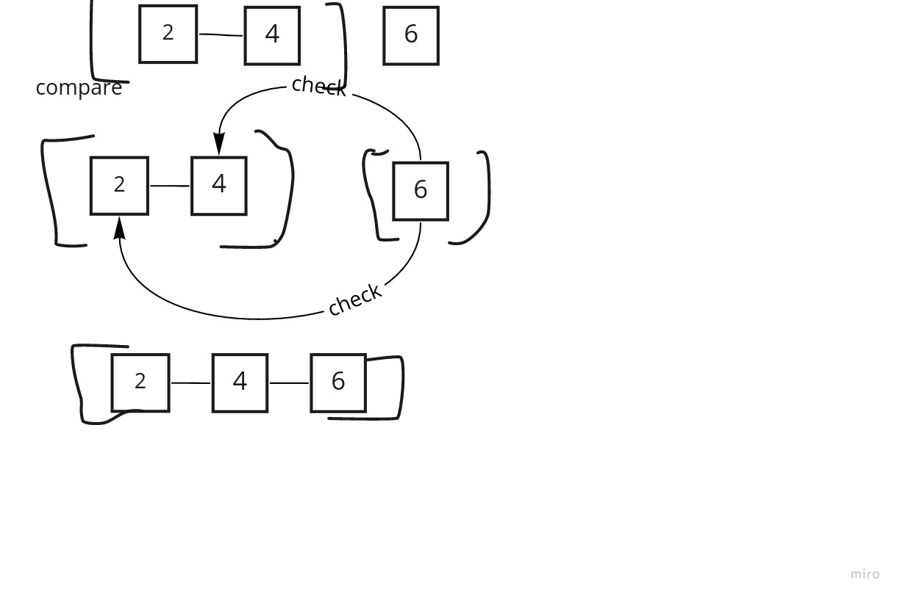
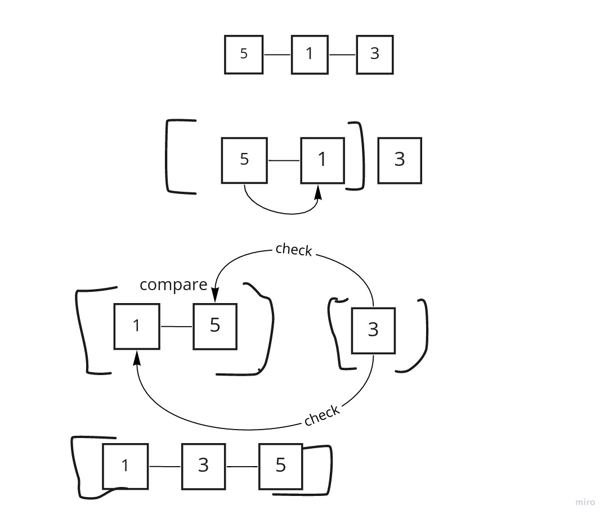
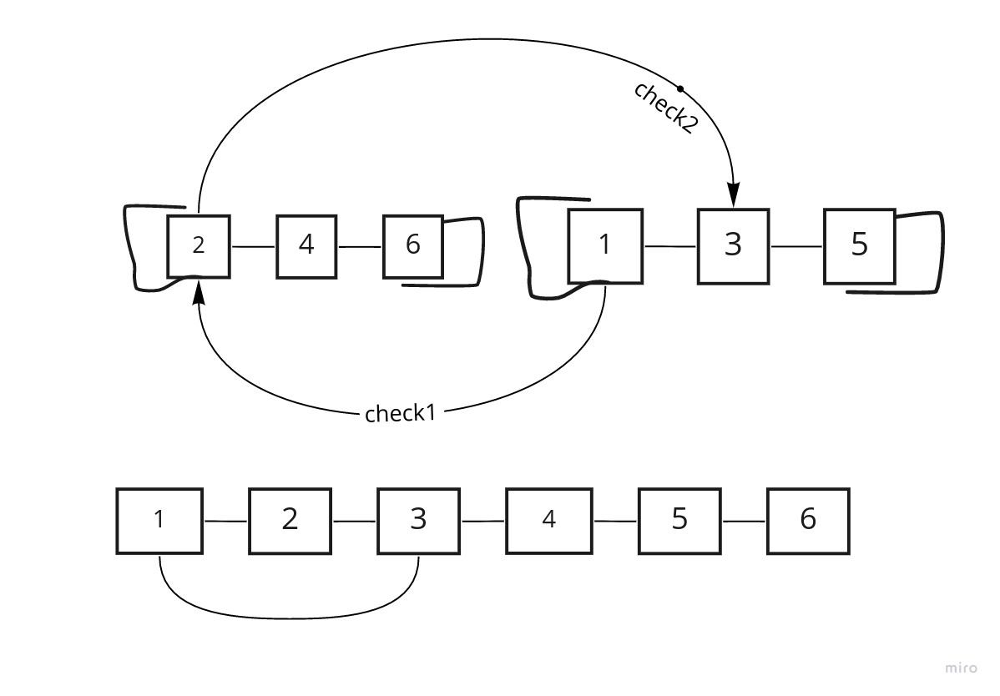

# merge sort

1 - split array into two halves

2 - create two variables to traverse each half at the same time (i & j) and create one to iterate the whole list and make changes along the way (k) (values assigned to k are sorted)

3 - compare left and rights, in this case each righ tis less than the left, so they switch places.

4 the second halfe will be the same 

5 - here we begin to merge the two halves back together. sort each new value from the right into the left until both lists are megered back together into one.

