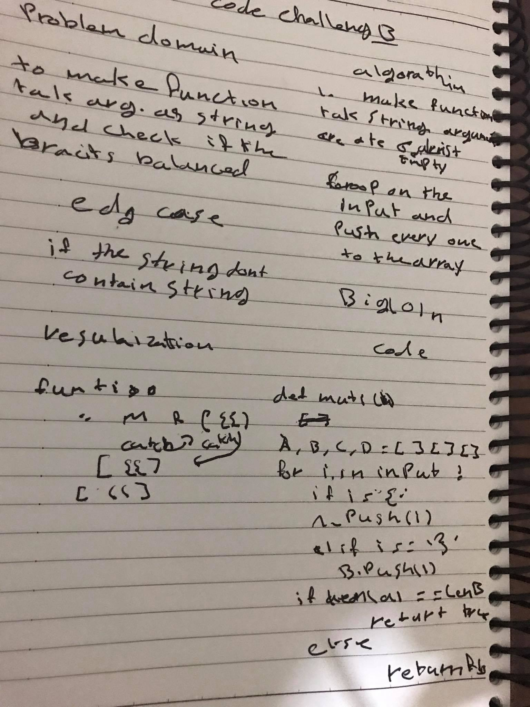

# multi bracket validation

## Challenge
make function should take a string as its only argument, and should return a boolean representing whether or not the brackets in the string are balanced

## Approach & Efficiency
use loops and if 

## Solution

