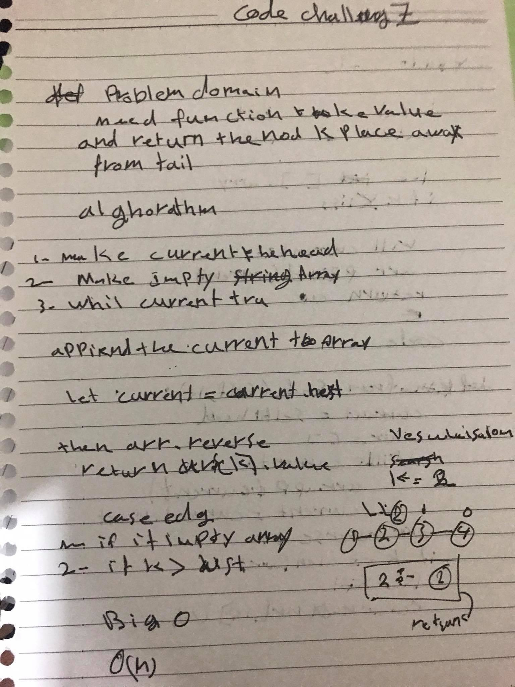
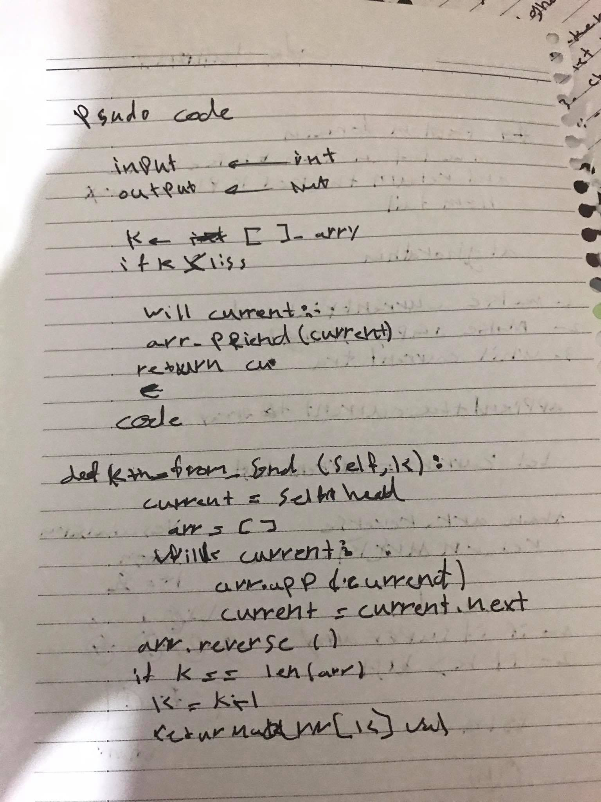

## Linked List

Classes and loops

## Challenge
function that take an array and a number and add the number to the middle index of the array

Approach & Efficiency
i used classes and while loop because i need to loop across all the elements

## BIG O
insert method
space --> O(n)
time --> O(1)
includes method
space --> Big O = O(n)
time --> Big O = O(n)
toString method
space --> Big O = O(n)
time --> Big O = O(n)

## api 
insert : adds an element to the list
includes : checks if an element exists in the list and returns a boolean (True/Flase)
insert_befor  : adds an element to the list befor element 
insert_befor  : adds an element to the list after element 
append  : adds an element to the list in the last node  
kth_from_end : to return the index from the end to value

## solution 

